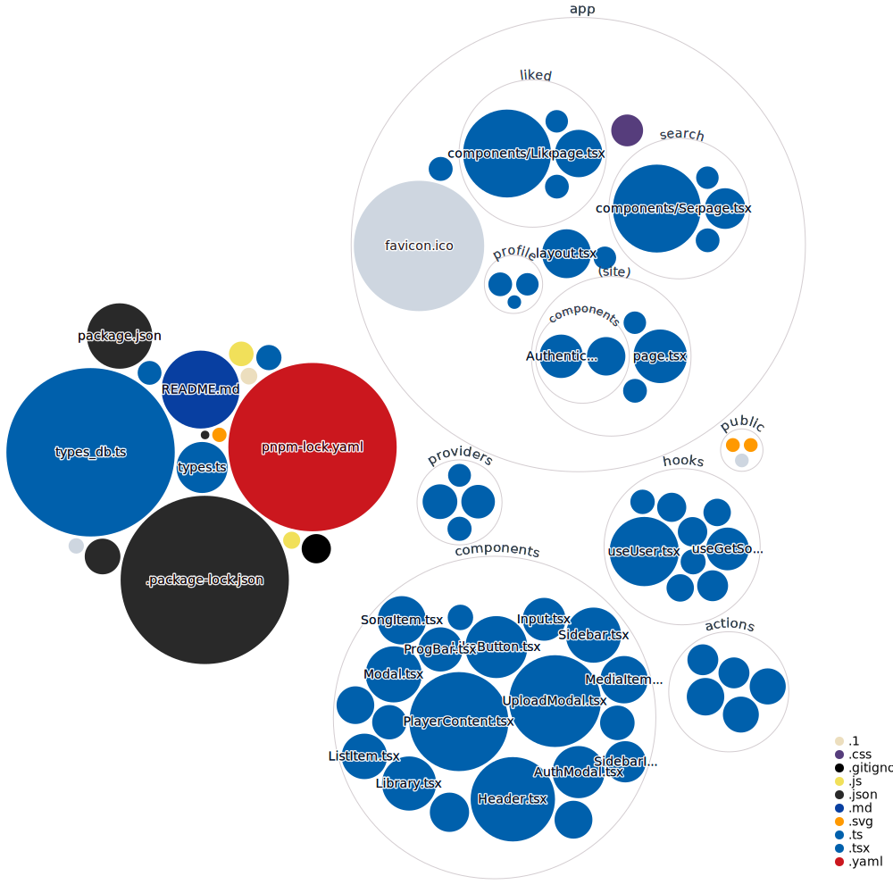

# Project Overview

This project is a music streaming web application built with React and TypeScript, and it uses Next.js for server-side rendering. The application allows users to upload, search for songs, like songs, and view their library of liked songs.

## Key Features

- **User Authentication**: The application includes an `AuthModal` component for user authentication.
- **Music Library**: Users can view their music library in the `Library` component.
- **Song Search**: Users can search for songs using the `getSongsByTitle` action.
- **Song Liking**: Users can like songs using the `LikeButton` component.

## Project Structure

The project is organized into several directories:

- **actions**: This directory contains TypeScript files for various actions, such as fetching songs by title or ID, and fetching liked songs.
- **app**: This directory contains the main application components, including error handling, global styles, and page layouts.
- **components**: This directory contains reusable React components, such as buttons, headers, and input fields.
- **hooks**: This directory contains custom React hooks for managing state and side effects.
- **providers**: This directory contains context providers for state management.
- **public**: This directory contains public assets like images and fonts.
- **types**: This directory contains TypeScript type definitions used throughout the project.

## Visualization of the repo



## Stack

Next 13.4
React
Vercel
Supabase
PostgreSQL
Tailwind
<!-- Stripe -->

This is a [Next.js](https://nextjs.org/) project bootstrapped with [`create-next-app`](https://github.com/vercel/next.js/tree/canary/packages/create-next-app).

## Key Features:

- Audio upload
- Supabase and PostgreSQL Database handling
- Tailwind design for sleek UI
- Tailwind animations and transition effects
- Full responsiveness for all devices
- Credential authentication with Supabase
- Github and Google authentication integration
- File and image upload using Supabase storage
- Client form validation and handling using react-hook-form
- Server error handling with react-toast
- Play audio
- Favorites system
- Playlists / Liked songs system
- Advanced Player component, with seek and stored volume control
- POST, GET, and DELETE routes in route handlers (app/api)
- Data Fetching in React server components by directly accessing the database without the need of API's
- Handling relations between Server and Child components in a real-time environment
<!-- - Cancelling Stripe subscriptions -->
<!-- - Stripe integration -->
<!-- - Stripe recurring payment integration -->


## Getting Started

First, run the development server:

```bash
npm run dev
# or
yarn dev
# or
pnpm dev
# or
bun dev
```

Open [http://localhost:3000](http://localhost:3000) with your browser to see the result.

You can start editing the page by modifying `app/page.tsx`. The page auto-updates as you edit the file.

This project uses [`next/font`](https://nextjs.org/docs/basic-features/font-optimization) to automatically optimize and load Inter, a custom Google Font.
